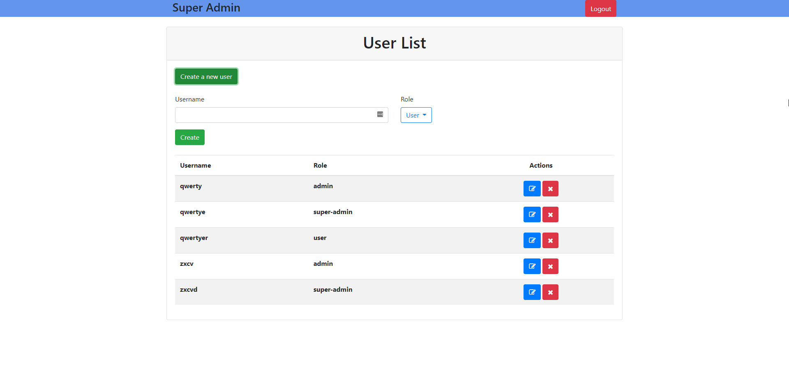

Super admin username is `root` 

There is only one super admin in the system, and it presets initially.

##Description

`JWT` is used for authorization in the project, created users are saved in localStorage.
There are 3 roles in the project. These are user, admin and super-admin.
`Authorization` processes are implemented according to these role models, and according to these models,
transitions to the relevant pages are provided.

_Project start date: 12:00 Oct 23, 2021_

_Project end date: 21:30 Oct 24, 2021_

#Photos
##Home Page

##Login

##User Create

##User List

